# DSGram

## 👥 Miembros del Equipo
| Nombre y Apellidos | Correo URJC | Usuario GitHub |
|:--- |:--- |:--- |
| Jaime Torroba Martínez | j.torroba.2023@alumnos.urjc.es | JaTorroba |
| Isidoro Pérez Rivera | i.perezr.2023@alumnos.urjc.es | Isiperezz |
| Pablo Ruiz Uroz | p.ruizu.2023@alumnos.urjc.es | pruizz |
| Hugo Capa Mora | h.capa.2023@alumnos.urjc.es | huugooocm |

---

## 🎭 **Preparación 1: Definición del Proyecto**

### **Descripción del Tema**
Red social de resolución de ejercicios de Estructuras de Datos donde los usuarios permiten interacturar y elegir la Estructura que consideren para resolver un ejercicio, creando la Estructura en tiempo real mediante un visualizador. 
La aplicación se ubica en sector educativo y social. Permite a los usuarios aprender a utilizar estructuras de datos para la resolución de casos de uso, aportándole una herramienta para potenciar su capacidad de identificación de uso de estas en problemas reales propuestos por otros usuarios.

### **Entidades**
Indicar las entidades principales que gestionará la aplicación y las relaciones entre ellas:

1. **Usuario**
2. **Ejercicio**
3. **Lista de ejercicios**
4. **Comentario**
5. **Solución**


**Relaciones entre entidades:**
- Usuario - Ejercicio: Un usuario puede resolver múltiples ejercicios. Un ejercicio puede ser solucionado por múltiples usuarios (N:M).
- Usuario - Lista de ejercicios: un usuario puede tener múltiples listas de ejercicios (1:N).
- Lista de ejercicios - Ejercicio: una lista de ejercicios puede tener múltiples ejercicios (1:N).
- Ejercicio - Solución: un ejercicio puede tener múltiples soluciones de distintos usuarios (1:N).
- Solución - Comentario: una solución a un ejercicio puede tener múltiples comentarios (1:N).
- Usuario - Usuario: un usuario puede seguir a uno o muchos usuarios y puede ser seguido por uno o muchos usuarios (N:M).
- Usuario - Comentario: un usuario puede hacer múltiples comentarios en una solución a un ejercicio (1:N).
  
### **Permisos de los Usuarios**
Describir los permisos de cada tipo de usuario e indicar de qué entidades es dueño:

* **Usuario Anónimo**: 
  - Permisos: Visualización de ejercicios.
  - No es dueño de ninguna entidad.

* **Usuario Registrado**: 
  - Permisos: Gestión de su perfil, crear y editar listas de ejercicios suyas, resolver ejercicios, comentar en soluciones a ejercicios, seguir a otro usuario, crear un ejercicio.
  - Es dueño de: Sus listas de ejercicios y ejercicios creados, comentarios realizados en otras soluciones y soluciones realizadas por él.

* **Administrador**: 
  - Permisos: Gestión de todos los usuarios, listas de ejercicios, ejercicios, soluciones y comentarios de todo el sistema.
  - Es dueño de: Cuentas de usuario, listas de ejercicios, ejercicios, soluciones y comentarios de todo el sistema; puede gestionar toda la información del sistema, a excepción de datos personales de los usuarios.

### **Imágenes**
Indicar qué entidades tendrán asociadas una o varias imágenes:

- **Usuario**: Una imagen de avatar por usuario.
- **Solución**: Una imagen en la solución de la Estructura de Datos que ha sido construida por el usuario.

### **Gráficos**
Indicar qué información se mostrará usando gráficos y de qué tipo serán:

- **Gráfico 1**: gráfico de barras de comparación de número de seguidores con número de seguidos.
- **Gráfico 2**: gráfico de progresión del número de seguidores a lo largo del tiempo.


### **Tecnología Complementaria**
Se podrá exportar un ejercicio a PDF y se utilizará una librería externa (CytoscapeJS) para el visualizador de artefactos. Se autentificará los permisos de los usuarios con OAuth2 o JWT.

- Exportación a PDFs de los ejercicios con iText o similar.
- Visualización de artefactos para la creación de Estructuras de Datos con CytoscapeJS o similar.
- Sistema de autenticación OAuth2 o JWT.

### **Algoritmo o Consulta Avanzada**
Indicar cuál será el algoritmo o consulta avanzada que se implementará:

- **Algoritmo/Consulta**: Sistema de recomendaciones de seguimiento a otros usuarios en base a las personas que uno ya sigue.
- **Descripción**: Buscar sugerencias de seguimiento a partir de seguidores de seguidores.
- **Alternativa**: Priorizar el feed  de publicaciones por el contenido de los ejercicios de las listas que referencian en vez de orden cronológico.

---

## 🛠 **Preparación 2: Maquetación de páginas con HTML y CSS**

### **Vídeo de Demostración**
📹 https://youtu.be/GWdQl1jbLx8
> Vídeo mostrando las principales funcionalidades de la aplicación web.

### **Diagrama de Navegación**
Diagrama que muestra cómo se navega entre las diferentes páginas de la aplicación:

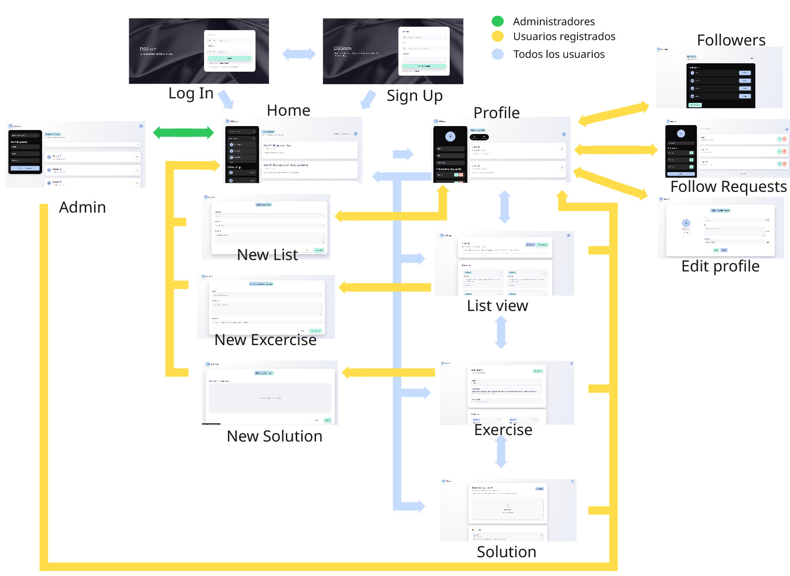

### **Capturas de Pantalla y Descripción de Páginas**

#### **1. Página Principal / Home**

> Página de inicio que muestra publicaciones recientes que refieren a contenido nuevo o modificado en listas de usuarios seguidos, ejercicios o soluciones suyas. También se mostrarán algunos de los usuarios seguidos, así como una barra de búsqueda para poder encontrar nuevos usuarios que seguir. 

#### **2. Página de inicio de sesión / Log In**

> Página que se muestra para acceder a la aplicación en la que el usuario podrá iniciar sesión o acceder de manera anónima.

#### **3. Página de Registro de usuario / Sign up**

> Página en la que un usuario no registrado podrá darse de alta con su correo, nombre de usuario y contraseña y podrá acceder a la aplicación tras hacerlo.

#### **4. Página del perfil de usuario / Profile**


> Página del perfil de usuario que muestra sus datos de la aplicación, sus solicitudes recientes, número de seguidos, seguidores y las listas que tiene subidas. Permite el acceso a editar perfil y cerrar sesión desde un menú que se despliega en la foto de perfil.

#### **5. Página de seguidores / Followers**
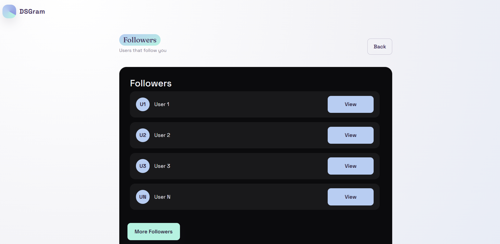
> Página que muestra los seguidores de un usuario determinado, permite mostrar más para ver la totalidad de usuarios que le siguen.

#### **6. Página de solicitudes de seguimiento  / Follow-requests**
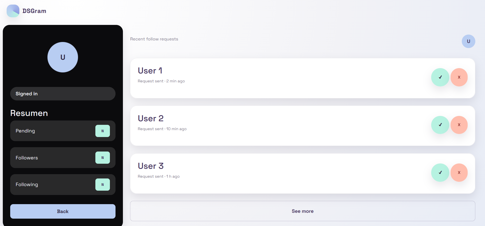
> Página para visualizar la totalidad de solicitudes de seguimiento que tiene un usuario para que pueda aceptarlas o rechazarlas.

#### **7. Página de Lista  / List-view**
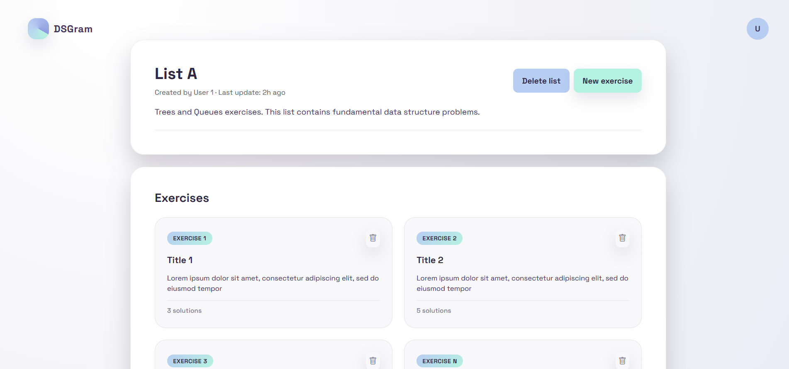
> Página en la que se podrán encontrar todos los ejercicios de la lista de un usuario

#### **8. Página de ejercicio / Exercise**

> Página en la que se encontrará el enunciado de un ejercicio y las soluciones de otros usuarios a este.

#### **9. Página de solución / Solution**
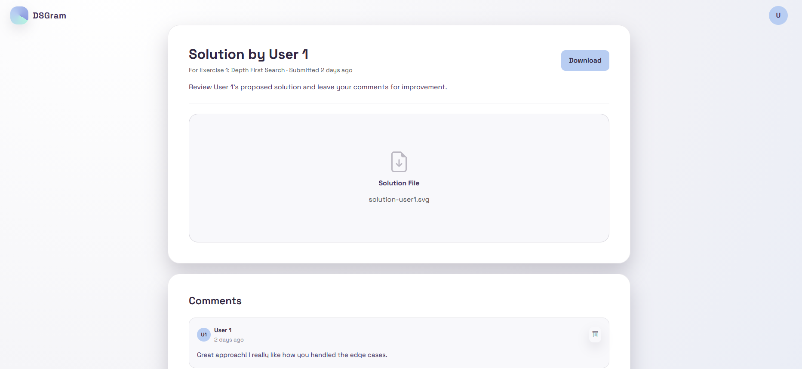
> Página en la que se encontrará la solución de un usuario a un ejercicio y los comentarios de otros usuarios a esta. Los usuarios registrados podrán añadir comentarios.


#### **10. Página de creación de una nueva lista/ New-list**

> Página de creación de una nueva lista de ejercicios que serán publicadas por un usuario en la aplicación. Se podra añadir titulo, descripción, y tipo principal de ejercicios.

#### **. 11 Página de creación de un nuevo ejercicio/ New-exercise**
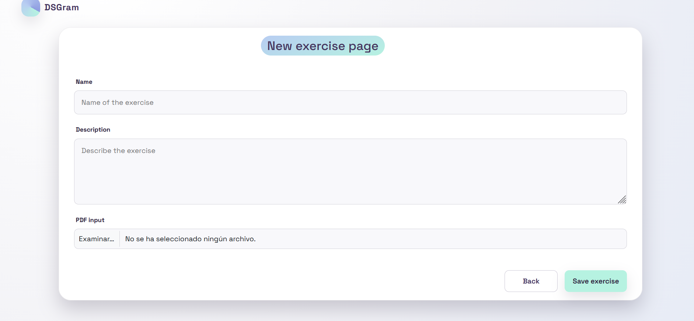
> Página de creación de una nuevo ejercicio que formara parte de una lista creada previamente.Cada ejercicicio podra contener nombre, descripción y un pdf adjunto con el enunciado detallado si existiera.

#### **. 12 Página de creación de una nueva solución/ New-Solution**

> Página de creación de una nueva solución creada para uno de los ejercicios publicados de una lista.Se podrá hacer uso del visualizador para crear la solución. 

#### **13. Página panel de administrador  / Admin panel**

> Página para que el usuario administrador pueda visualizar el panel que tiene para poder ejecutar sus poderes especiales, como borrar usuarios, listas y ejercicios.

#### **14. Página de editar perfil  / Edit profile**
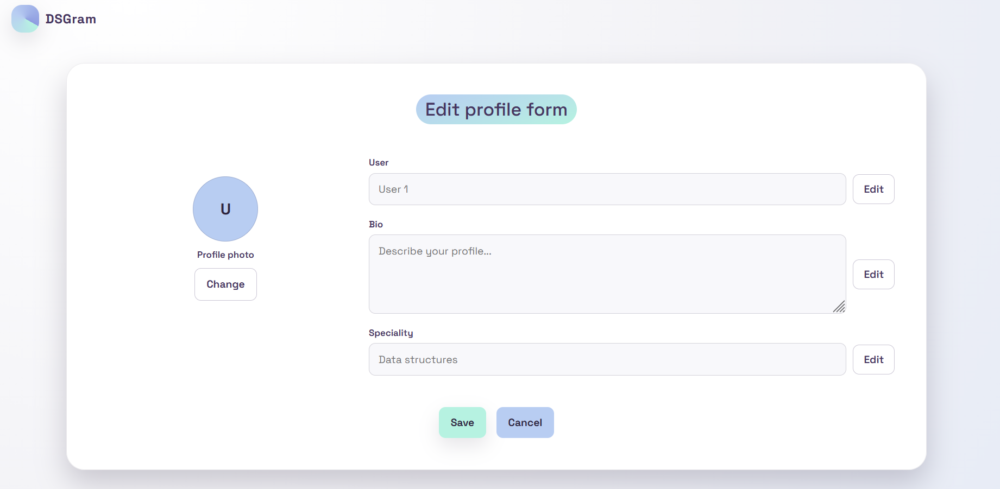
> Página para que el usuario pueda editar sus datos de nombre, descripción, especialidad y foto de perfil.


---

## 🛠 **Práctica 1: Web con HTML generado en servidor y AJAX**

### **Vídeo de Demostración**
📹 **[Enlace al vídeo en YouTube](https://www.youtube.com/watch?v=9E4HDM51W4Y)**
> Vídeo mostrando las principales funcionalidades de la aplicación web.

### **Navegación y Capturas de Pantalla**

#### **Diagrama de Navegación**

Mientras que la apariencia de las pantallas ha cambiado, el flujo de navegación sigue siendo el mismo que el especificado en el anterior diagrama, a excepción de nuevas opciones para administradores que pueden dirigirse a las páginas de detalle de las entidades que gestionan desde el panel de administración. Además, dependiendo del flujo de ejecución y peticiones del usuario se mostrará una información u otra en cada una de las páginas del diagrama p.ej. mostrar el perfil propio o el de otro usuario; sin embargo la navegación entre páginas no se ve alterada.

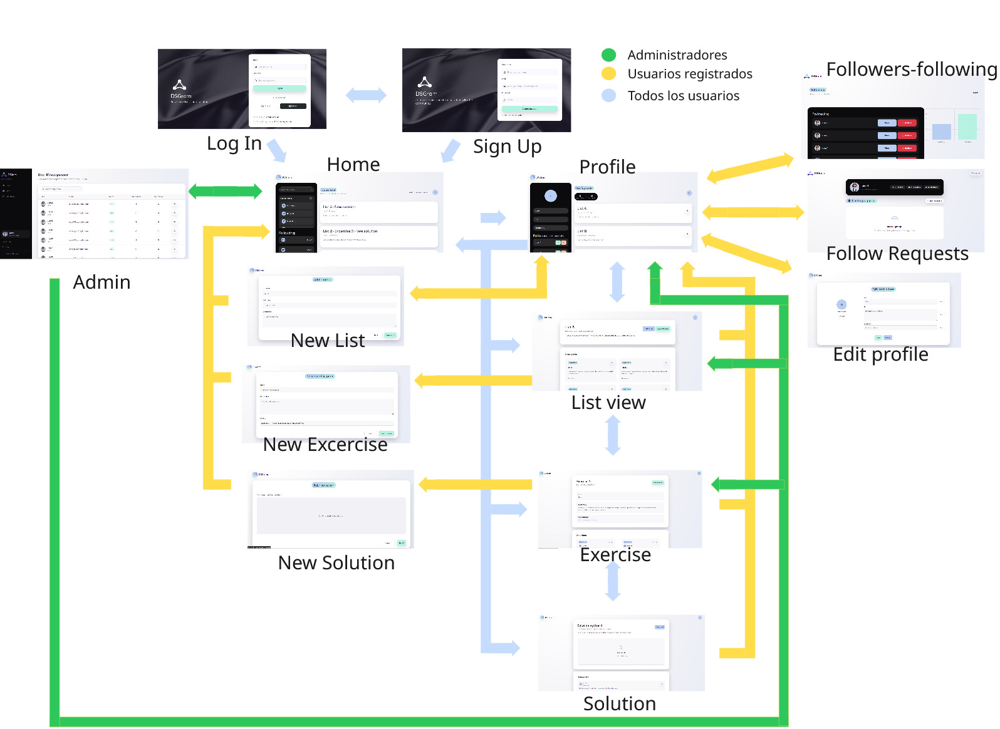

#### **Capturas de Pantalla Actualizadas**

#### **1. Página Principal**
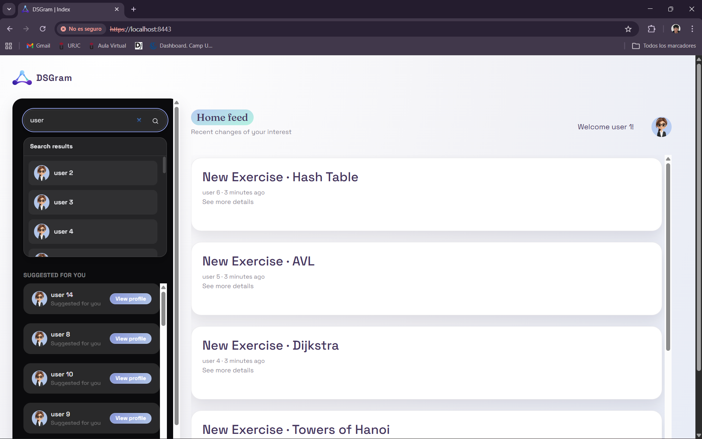
> Página de inicio que muestra publicaciones recientes que refieren a contenido nuevo o modificado en listas de usuarios seguidos, ejercicios o soluciones suyas. También se mostrarán algunos de los usuarios sugeridos, así como una barra de búsqueda para poder encontrar nuevos usuarios que seguir. 

#### **2. Página de inicio de sesión / Log In**
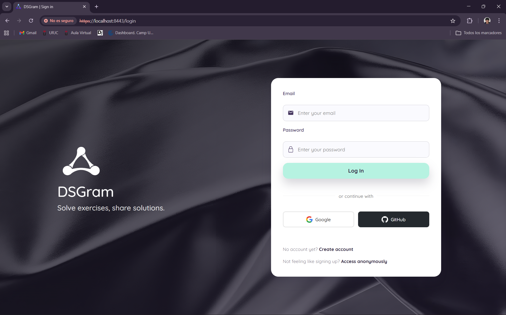
> Página que se muestra para acceder a la aplicación en la que el usuario podrá iniciar sesión con correo en la aplicación, cuenta de Google, cuenta de Github o acceder de manera anónima.

#### **3. Página de Registro de usuario / Sign up**
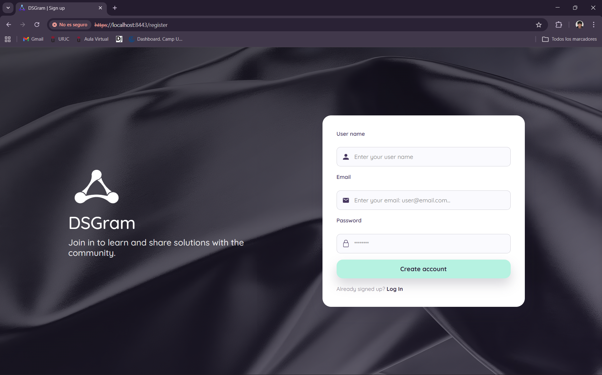
> Página en la que un usuario no registrado podrá darse de alta con su correo, nombre de usuario y contraseña y podrá acceder a la aplicación tras hacerlo.

#### **4. Página Principal Anónima / Anonymous Home**

> Vista de la página principal orientada a usuarios no registrados, permitiendo explorar parte de la plataforma antes de iniciar sesión.

#### **5. Vista Anónima / Anonymous View**

> Interfaz que muestra contenido privado a los usuarios que navegan por la aplicación sin tener una cuenta activa.

#### **6. Perfil de Usuario / Profile**
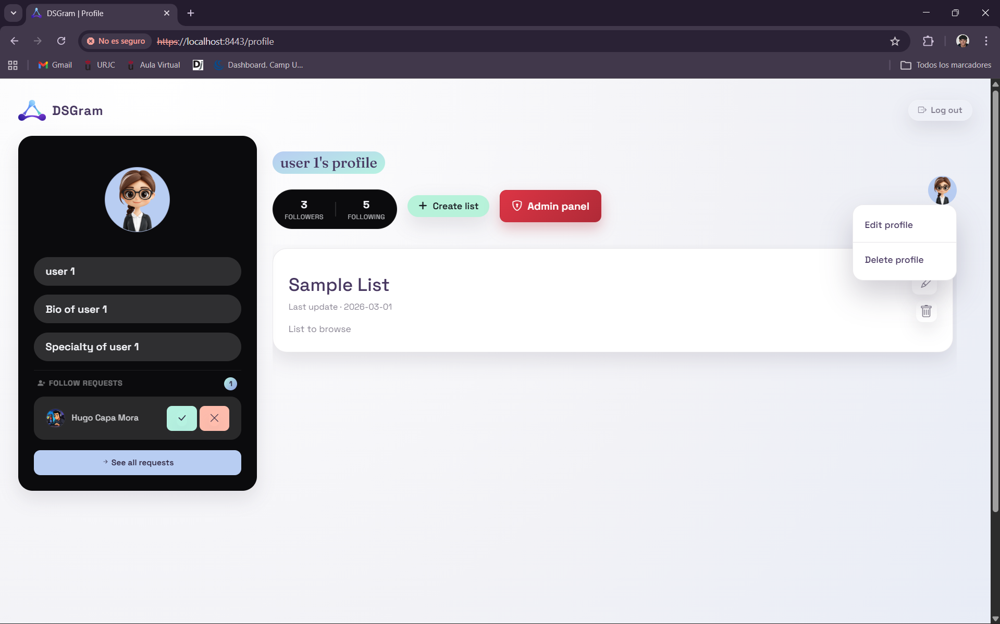
> Página personal del usuario donde se muestra su información, biografía, contadores de seguidores/seguidos y las listas de ejercicios que ha creado.

#### **7. Seguidores / Followers**

> Listado completo de todos los usuarios que siguen a la cuenta actual, permitiendo gestionar la comunidad.

#### **8. Seguidos / Following**

> Listado de todas las cuentas a las que el usuario actual está siguiendo en la plataforma.

#### **9. Solicitudes de Seguimiento / Follow Requests**

> Panel donde el usuario puede gestionar su privacidad aceptando o rechazando las peticiones de seguimiento de otras personas.

#### **10. Panel de Administración de Usuarios / Admin Panel Users**
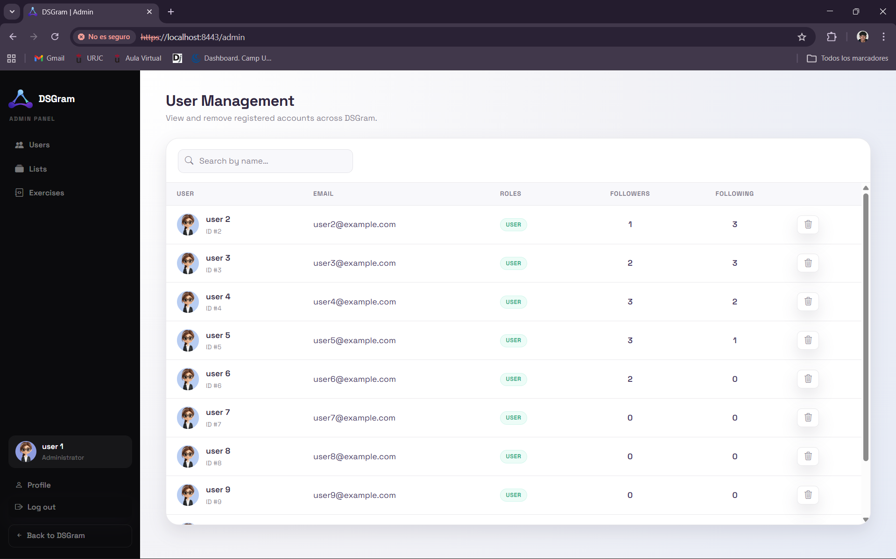
> Herramienta exclusiva para administradores que permite gestionar, buscar y moderar las cuentas de usuario registradas en el sistema.

#### **11. Panel de Administración de Listas / Admin Panel Lists**

> Vista administrativa diseñada para supervisar, editar o eliminar de forma global las listas creadas por los usuarios.

#### **12. Panel de Administración de Ejercicios / Admin Panel Exercises**

> Interfaz de administración dedicada a la moderación y control de todos los ejercicios publicados en la plataforma.

#### **13. Editar Perfil / Edit Profile**

> Formulario de ajustes donde el usuario puede actualizar su foto de perfil, nombre, biografía y especialidad.

#### **14. Vista de Lista / List View**

> Visualización detallada de una lista propia, mostrando todos los ejercicios que contiene y permitiendo su completa gestión.

#### **15. Editar Lista / Edit List**

> Pantalla de edición para modificar los detalles de una lista existente, como cambiar su título o actualizar su descripción.

#### **16. Añadir Lista / Add List**

> Formulario principal para que el usuario pueda crear una nueva lista y empezar a organizar su contenido.

#### **17. Añadir Ejercicio / Add Exercise**

> Página que permite añadir un nuevo ejercicio a una lista, incluyendo campos para el título, descripción y la subida de un archivo PDF adjunto.

#### **18. Añadir Solución / Add Solution**
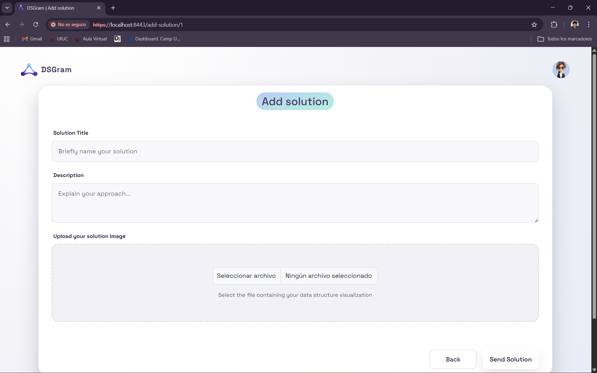
> Interfaz específica para que los usuarios puedan publicar la respuesta o resolución a un ejercicio en concreto.

#### **19. Vista de Ejercicio / Exercise View**
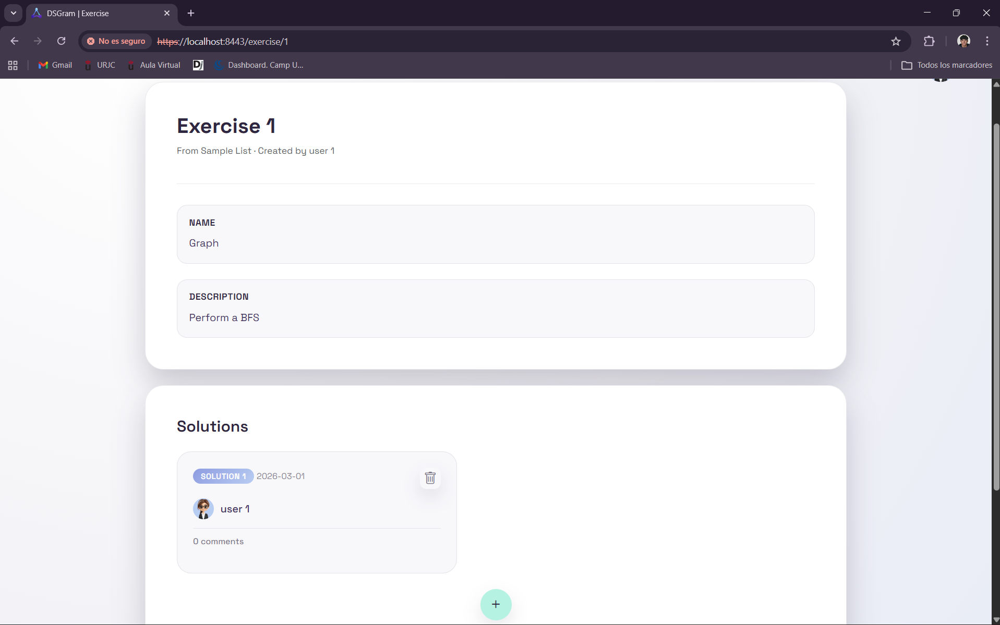
> Detalle completo de un ejercicio propio, donde se puede consultar el enunciado, ver el PDF asociado y gestionar las soluciones aportadas.

#### **20. Vista de Solución / Solution View**
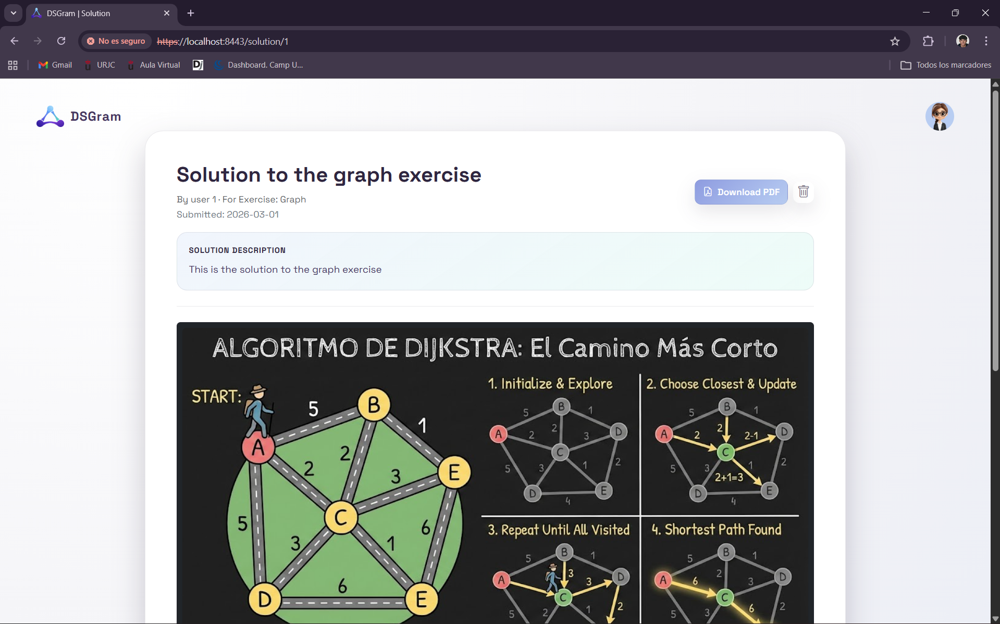
> Página enfocada en mostrar la resolución detallada de un ejercicio para su consulta o evaluación, permitiendo su exportación a pdf.

#### **21. Añadir Comentario / Add Comment**

> Sección habilitada para interactuar con el contenido, permitiendo dejar feedback, valoraciones o dudas en los ejercicios y soluciones.

#### **22. Perfil de Otro Usuario / Other Profile**

> Vista pública del perfil de un tercero, donde se pueden consultar sus listas públicas y enviarle una solicitud para seguirle.

#### **23. Vista de Lista (No Propietario) / List View Not Owner**

> Visualización de una lista perteneciente a otro usuario. Permite consultar el contenido organizado pero sin opciones de borrado.

#### **24. Vista de Ejercicio (No Propietario) / Exercise View Not Owner**

> Pantalla de un ejercicio creado por otra persona. Permite consultar el enunciado y añadir soluciones, pero no borrarlas.

### **Instrucciones de Ejecución**

#### **Requisitos Previos**
- **Java**: versión 21 o superior
- **Maven**: versión 3.8 o superior (`mvn`)
- **Docker**: para levantar la base de datos MySQL
- **Git**: para clonar el repositorio

#### **Pasos para ejecutar la aplicación**

1. **Clonar el repositorio**
   ```bash
   git clone https://github.com/CodeURJC-DAW-2025-26/practica-daw-2025-26-grupo-15.git
   cd practica-daw-2025-26-grupo-15
   ```

2. **Crear el archivo `.env` en la raíz del repositorio**

   Es obligatorio crear un fichero llamado `.env` en la raíz del repositorio (junto a `start_db.sh`) con las siguientes variables de entorno:
   
   ```properties
   DB_USERNAME=<usuario>
   DB_PASSWORD=<contraseña>
   DB_NAME=<nombre del esquema de BD>
   DB_CONFIG=<Modo de inicialización de la BD>
   KEYSTORE_PASSWORD=<contraseña del keystore>
   KEYSTORE_SECRET=<secreto del keystore>
   GOOGLE_CLIENT_ID=<client id de Google OAuth2>
   GOOGLE_CLIENT_SECRET=<client secret de Google OAuth2>
   GITHUB_CLIENT_ID=<client id de GitHub OAuth2>
   GITHUB_CLIENT_SECRET=<client secret de GitHub OAuth2>
   ```

   > Los valores de `KEYSTORE_PASSWORD` y `KEYSTORE_SECRET` deben coincidir con los usados al generar el `keystore.jks` incluido en el proyecto. Los valores de Google y GitHub se obtienen registrando una aplicación OAuth2 en sus respectivas consolas de desarrollador.

3. **Arrancar la base de datos MySQL con Docker**
   ```bash
   bash start_db.sh
   ```
   Esto levanta un contenedor MySQL 9.2 con la base de datos `dsgram` en el puerto `3306`. Las credenciales son `root` / `password`.

4. **Compilar y ejecutar la aplicación**

   Se puede arrancar de cualquiera de las siguientes formas. En todos los casos es importante que el directorio de trabajo sea la **raíz del repositorio** para que Spring Boot encuentre el `.env`.

   **Opción A — Maven desde terminal** (requiere `mvn` instalado):
   ```bash
   mvn -f backend/pom.xml spring-boot:run
   ```

   **Opción B — Clase `main` de Java** (desde el IDE):
   Ejecutar directamente la clase `es.codeurjc.daw.library.Application` con la raíz del repositorio como directorio de trabajo (_working directory_).

   **Opción C — Extensión Spring Boot Dashboard de VS Code**:
   Con la extensión [Spring Boot Dashboard](https://marketplace.visualstudio.com/items?itemName=vscjava.vscode-spring-boot-dashboard) instalada, aparecerá el proyecto en el panel lateral. Antes de arrancarlo, asegúrate de que el _working directory_ configurado apunta a la raíz del repositorio (por defecto lo hace si abres VS Code desde ahí). Pulsa el botón ▶ junto al proyecto para iniciarlo.

   > En los tres casos Spring Boot cargará automáticamente el fichero `.env` de la raíz al arrancar.

5. **Acceder a la aplicación**

   La aplicación se sirve únicamente por HTTPS. Abre en el navegador:
   ```
   https://localhost:8443
   ```
   > El certificado es autofirmado, por lo que el navegador mostrará una advertencia de seguridad. Acepta la excepción para continuar.

#### **Credenciales de prueba**
- **Usuario Admin**: usuario: `user1@example.com`, contraseña: `pass`
- **Usuario Registrado**: usuario: `user2@example.com`, contraseña: `pass`

### **Diagrama de Entidades de Base de Datos**

Diagrama mostrando las entidades, sus campos y relaciones:


> El diagrama muestra las entidades de la aplicación

### **Diagrama de Clases y Templates**

Diagrama de clases de la aplicación con diferenciación por colores o secciones:


> Los controladores utilizan mútliples servicios. Cada servicio utiliza su respectivo repositorio además de otros servicios que les sean necesarios, lo cual no ha sido representado en el diagrama por simplicidad. Se utilizan también colores diferentes para cada controlador para un mejor entendimiento. Las realciones entre entidades son numerosas porque se ha implementado bidirección entre ellas.

### **Participación de Miembros en la Práctica 1**

#### **Alumno 1 - Hugo Capa Mora**

Responsable del desarrollo integral de la lógica de negocio para la gestión y vista de listas, ejercicios, soluciones y comentarios, junto con la implementación de consultas avanzadas de base de datos para el sistema de sugerencias de seguimiento y validaciones dinámicas en el frontend para optimizar la experiencia de usuario.

| Nº    | Commits      | Files      |
|:------------: |:------------:| :------------:|
|1| [feat: Advanced query algorithm in native SQL for follow-up suggestions](http://github.com/CodeURJC-DAW-2025-26/practica-daw-2025-26-grupo-15/commit/240b1232c754dfab2742bddd692051dadc4203ec)  | [UserRepository](backend/src/main/java/es/codeurjc/daw/library/repository/UserRepository.java)   |
|2| [Entities ExerciseList, Exercise, Solution, Comment (bidirectionality of cardinalities missing) & attempt to display list-view](https://github.com/CodeURJC-DAW-2025-26/practica-daw-2025-26-grupo-15/commit/1bd9b4bd0bddb631e5b7c74d0ed28cd0c2363996)  | [Exercise](backend/src/main/java/es/codeurjc/daw/library/model/Exercise.java)   |
|3| [View of solution page & Comment form with PostMapping](https://github.com/CodeURJC-DAW-2025-26/practica-daw-2025-26-grupo-15/commit/6e4495b85b32bdc9d0cd457dfad53ff18e1b8c07)  | [CommentController](backend/src/main/java/es/codeurjc/daw/library/controller/CommentController.java)   |
|4| [Correct navigation between lists, exercises, solutions, and comments](https://github.com/CodeURJC-DAW-2025-26/practica-daw-2025-26-grupo-15/commit/4f8c3fa5eae7e1486ebc92d8308c2deef4f7317d)  | [ExerciseListController](backend/src/main/java/es/codeurjc/daw/library/controller/ExerciseListController.java)   |
|5| [Functionality to add exercises to exercise lists](https://github.com/CodeURJC-DAW-2025-26/practica-daw-2025-26-grupo-15/commit/6d646dd2c2d5c6b6714003cdafcc38ebf9e91917)  | [ExerciseService](backend/src/main/java/es/codeurjc/daw/library/service/ExerciseService.java)   |

---

#### **Alumno 2 - Isidoro Pérez Rivera**

Responsable de la lógica e implementación de la relación entre usuarios: solicitudes de seguimiento y funcionalidad de seguir y dejar de seguir usuarios, así como la visualización de dichas características en sus respectivas páginas de detalle. Implementación de la funcionalidad de edición de varias entidades y modularización de plantillas con atributos de mustache.

| Nº    | Commits      | Files      |
|:------------: |:------------:| :------------:|
|1| [Implement follow request acceptance and decline functionality, update user profile interactions](https://github.com/CodeURJC-DAW-2025-26/practica-daw-2025-26-grupo-15/commit/85c66092258faa55e0c3c4ca41c796544d367ac8)  | [UserController](backend/src/main/java/es/codeurjc/daw/library/controller/UserController.java)   |
|2| [Refactor followers and following functionality with new unified view and remove deprecated templates. Now its possible to watch other peoples followers and following without being able to make any changes. You also can watch your own followers and following list in which you can do changes](https://github.com/CodeURJC-DAW-2025-26/practica-daw-2025-26-grupo-15/commit/a95909881c26dee4a8127df9408343a9fd816d3b)  | [followers-following](backend/src/main/resources/templates/followers-following.html)   |
|3| [Implement list editing functionality and enhance user interface](https://github.com/CodeURJC-DAW-2025-26/practica-daw-2025-26-grupo-15/commit/bbd7b4ec9b0e6cc247adb2ecedabea18d9ca230a)  | [ExerciseListController](backend/src/main/java/es/codeurjc/daw/library/controller/ExerciseListController.java)   |
|4| [Add user profile editing functionality with validation; update User model and views](github.com/CodeURJC-DAW-2025-26/practica-daw-2025-26-grupo-15/commit/ec6a31be2e1ce5344f391cfd82bcc9746badc0ba)  | [edit-profile-form](backend/src/main/resources/templates/edit-profile-form.html)   |
|5| [Implement follow request feature and update user profile statistics](https://github.com/CodeURJC-DAW-2025-26/practica-daw-2025-26-grupo-15/commit/82be6cefbd146b1472aa6e44a76b5f1d2b4a2960)  | [UserController](backend/src/main/java/es/codeurjc/daw/library/controller/UserController.java)   |

---

#### **Alumno 3 - Jaime Torroba Martínez**

Encargado del sistema de Posts, del sistema de scroll implementado con AJAX para los feeds así como en el panel de administración, en el que también se implementa filtrado por el nombre. Búsqueda de usuarios en la página principal y creación y edición de la entidad Exercise con la opción de adjuntar un archico PDF llevando a cabo las comprobaciones necesarias tanto en front como en back para comprobar el tipo de archivo; pudiendo además decargar el PDF adjuntado a un ejercicio ya subido.

| Nº    | Commits      | Files      |
|:------------: |:------------:| :------------:|
|1| [Add admin panel full functionalities for searching users, lists & exercises with and without filter.](https://github.com/CodeURJC-DAW-2025-26/practica-daw-2025-26-grupo-15/commit/cef1a88dbf68f819d46a31e948df66c982d988d4)  | [AdminController](backend/src/main/java/es/codeurjc/daw/library/controller/AdminController.java)   |
|2| [ Add following reflexive relation on User](https://github.com/CodeURJC-DAW-2025-26/practica-daw-2025-26-grupo-15/commit/1157bb1e6e0dbe1d925541412e2819944ed1373e)  | [feed.js](backend/src/main/resources/static/js/feed.js)   |
|3| [Add post creation on lists, exercises & comments creation & update.](https://github.com/CodeURJC-DAW-2025-26/practica-daw-2025-26-grupo-15/commit/bdcb693980bf179e9ad6d73bdb17313a9d170a22)  | [PostService](backend/src/main/java/es/codeurjc/daw/library/service/PostService.java)   |
|4| [Add edit and create exercise with pdf input check and appliance. Download pdf file from exercise.](https://github.com/CodeURJC-DAW-2025-26/practica-daw-2025-26-grupo-15/commit/c7df8009b963228ab3741234524b9f6a9777e410)  | [ExerciseService](backend/src/main/java/es/codeurjc/daw/library/service/ExerciseService.java)   |
|5| [Fix search users infinite scroll (end users search bar implementation)](https://github.com/CodeURJC-DAW-2025-26/practica-daw-2025-26-grupo-15/commit/36e48d100ff68f2254e9e19d14996f23b3711d8e)  | [home.js](backend/src/main/resources/static/js/home.js)   |

---

#### **Alumno 4 - Pablo Ruiz Uroz**

Responsable de la integración de tecnologías externas, incluyendo la implementación del sistema de autenticación mediante OAuth2 con Google y GitHub, así como la funcionalidad de exportación a PDF. Desarrollo de toda la lógica de seguridad de la aplicación: gestión de usuarios y entidades relacionadas, comprobaciones de permisos y validaciones de acceso.
Implementación de la lógica de gestión de imágenes en todas las entidades del sistema, asegurando sus correctas relaciones y funcionamiento.
Desarrollo de las funcionalidades de borrado de usuarios, creación y gestión del panel de administración, y control de la visualización de páginas accesibles para usuarios anónimos.
Control dinámico de los elementos mostrados en la interfaz según el rol del usuario y definición de la lógica de acceso en función del tipo de usuario autenticado.

| Nº    | Commits      | Files      |
|:------------: |:------------:| :------------:|
|1| [Implement OAuth2 authentication with Google and GitHub](https://github.com/CodeURJC-DAW-2025-26/practica-daw-2025-26-grupo-15/commit/c2ce9d296370937038237effdd5d12c91a92e2df)  | [OAuthUserServie](backend/src/main/java/es/codeurjc/daw/library/security/OAuthUserService.java)   |
|2| [Add user registration feature with validation and error handling](https://github.com/CodeURJC-DAW-2025-26/practica-daw-2025-26-grupo-15/commit/acdde38588b5c7e5a895fc986cfc6be79ca97a59)  | [UserService](backend/src/main/java/es/codeurjc/daw/library/service/UserService.java)   |
|3| [Admin Panel Functionality](https://github.com/CodeURJC-DAW-2025-26/practica-daw-2025-26-grupo-15/commit/fa3674a6a4a842004cbc3ed0c1422607d878ff95)  | [UserController](backend/src/main/java/es/codeurjc/daw/library/controller/UserController.java)   |
|4| [PDF Solution Export Functionality](https://github.com/CodeURJC-DAW-2025-26/practica-daw-2025-26-grupo-15/commit/aa8ccc589ed7d6dea7735d568148e0fe230d9da3)  | [SolutionPdfExportService](backend/src/main/java/es/codeurjc/daw/library/service/SolutionPdfExportService.java)   |
|5| [Login with Email Functionality](https://github.com/CodeURJC-DAW-2025-26/practica-daw-2025-26-grupo-15/commit/3344f995316134e9a665f3c1364bf095d1c249ad)  | [WebController](backend/src/main/java/es/codeurjc/daw/library/controller/WebController.java)   |

---

## 🛠 **Práctica 2: Incorporación de una API REST a la aplicación web, despliegue con Docker y despliegue remoto**

### **Vídeo de Demostración**
📹 **[Enlace al vídeo en YouTube](https://www.youtube.com/watch?v=ECXArVw0AcQ)**
> Vídeo mostrando las principales funcionalidades de la aplicación web.

### **Documentación de la API REST**

#### **Especificación OpenAPI**
📄 **[Especificación OpenAPI (YAML)](backend/api-docs/api-docs.yaml)**

#### **Documentación HTML**
📖 **[Documentación API REST (HTML)](https://raw.githack.com/CodeURJC-DAW-2025-26/practica-daw-2025-26-grupo-15/main/backend/api-docs/api-docs.html)**

> La documentación de la API REST se encuentra en la carpeta `/api-docs` del repositorio. Se ha generado automáticamente con SpringDoc a partir de las anotaciones en el código Java.

### **Diagrama de Clases y Templates Actualizado**

Diagrama actualizado incluyendo los @RestController y su relación con los @Service compartidos:


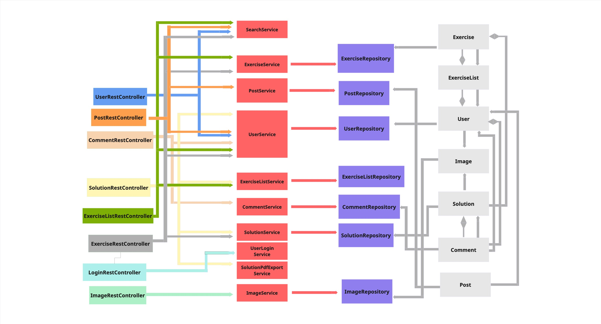

### **Instrucciones de Ejecución con Docker**

#### **Requisitos previos:**
- Docker instalado (versión 20.10 o superior)
- Docker Compose instalado (versión 2.0 o superior)

#### **Pasos para ejecutar con docker-compose:**

1. **Crear el archivo `.env`**

   Es obligatorio crear un fichero llamado `.env` en el lugar donde se vaya a ejecutar el comando docker compose con las siguientes variables de entorno:

   ```properties
   DB_USERNAME=<usuario-bd>
   DB_PASSWORD=<contraseña-bd>
   DB_NAME=<nombre-esquema-BD>
   DB_CONFIG=<Modo-inicialización-BD>
   KEYSTORE_PASSWORD=<contraseña del keystore>
   KEYSTORE_SECRET=<secreto del keystore>
   GOOGLE_CLIENT_ID=<client id de Google OAuth2>
   GOOGLE_CLIENT_SECRET=<client secret de Google OAuth2>
   GITHUB_CLIENT_ID=<client id de GitHub OAuth2>
   GITHUB_CLIENT_SECRET=<client secret de GitHub OAuth2>
   ```

   > Los valores de `KEYSTORE_PASSWORD` y `KEYSTORE_SECRET` deben coincidir con los usados al generar el `keystore.jks` incluido en el proyecto. Los valores de Google y GitHub se obtienen registrando una aplicación OAuth2 en sus respectivas consolas de desarrollador.

3. **Ejecutar los contenedores**:
   ```bash
   env $(cat .env | xargs) docker compose -f oci://docker.io/pruizz/dsgram-app-compose:1.0.0 up
   ```

### **Construcción de la Imagen Docker**

#### **Requisitos:**
- Docker instalado en el sistema
- Una cuenta en Docker Hub u otro registro.

#### **Pasos para construir y publicar la imagen:**

1. **Construir la imagen**:
   Para construir la imagen etiquetada, puedes ejecutar el script proporcionado indicando tu nombre de usuario de Docker Hub:
   ```bash
   create-image.sh <tu-usuario-dockerhub> <version-tag>
   ```
   O también puedes ejecutar el siguiente comando en el mismo directorio donde se encuentra el Dockerfile:
   ```bash
   docker build -t <tu-usuario-docker>/<nombre-de-la-imagen>:<version-tag>
   ```

2. **Publicar la imagen**:
   Inicia sesión en Docker y ejecuta el script de subida:
   ```bash
   docker login
   publish_image.sh <tu-usuario-dockerhub> <version-tag>
   ```
   O también puedes ejecutar el siguiente comando:
    ```bash
   docker login
   docker push <tu-usuario-dockerhub>/<nombre-de-la-imagen>:<version-tag>
   ```
3. **Publicar el Compose**:
   Inicia sesión en Docker y ejecuta el script de subida:
   ```bash
   docker login
   publish_docker-compose.sh <tu-usuario-dockerhub> <version-tag>
   ```
   O también puedes ejecutar el siguiente comando en el mismo directorio donde se encuentra el docker-compose:
    ```bash
   docker login
   docker compose publish <tu-usuario-dockerhub>/<nombre-compose>:<version-tag>
   ```
4. **Descargar el OCI Artifact y ejecutar los contenedores**:
   ```bash
   env $(cat .env | xargs) docker compose -f oci://docker.io/pruizz/dsgram-app-compose:1.0.0 up
   ```

### **Despliegue en Máquina Virtual**

#### **Requisitos:**
- Acceso a la máquina virtual (SSH)
- Clave privada para autenticación
- Conexión a la red correspondiente o VPN configurada

#### **Pasos para desplegar:**

1. **Conectar a la máquina virtual**:
   ```bash
   ssh -i [ruta/a/clave.key] [usuario]@[IP-o-dominio-VM]
   ```
   Ejemplo:
   ```bash
   ssh -i ssh-keys/appWeb15.key vmuser@10.100.139.208
   ```

2. **Crear el archivo `.env`**

   Es obligatorio crear un fichero llamado (`.env`) en el lugar donde vayas a descargar la imagen de DockerHub:

   ```properties
   DB_USERNAME=<usuario-bd>
   DB_PASSWORD=<contraseña-bd>
   DB_NAME=<nombre-esquema-BD>
   DB_CONFIG=<Modo-inicialización-BD>
   KEYSTORE_PASSWORD=<contraseña del keystore>
   KEYSTORE_SECRET=<secreto del keystore>
   GOOGLE_CLIENT_ID=<client id de Google OAuth2>
   GOOGLE_CLIENT_SECRET=<client secret de Google OAuth2>
   GITHUB_CLIENT_ID=<client id de GitHub OAuth2>
   GITHUB_CLIENT_SECRET=<client secret de GitHub OAuth2>
   ```

   > Los valores de `KEYSTORE_PASSWORD` y `KEYSTORE_SECRET` deben coincidir con los usados al generar el `keystore.jks` incluido en el proyecto. Los valores de Google y GitHub se obtienen registrando una aplicación OAuth2 en sus respectivas consolas de desarrollador.

3. **Desplegar la aplicación en la VM**:
   Navega al directorio donde tienes el archivo (`.env`) e inicia la aplicación:
   ```bash
    env $(cat .env | xargs) docker compose -f oci://docker.io/<tu-usuario-dockerhub>/<nombre-compose>:<version-tag> up
   ```
   o usar la imagen ya existente:
   ```bash
    env $(cat .env | xargs) docker compose -f oci://docker.io/pruizz/dsgram-app-compose:1.0.0 up
   ```


### **URL de la Aplicación Desplegada**

🌐 **URL de acceso**: `https://appweb15.dawgis.etsii.urjc.es:8443`

#### **Credenciales de Usuarios de Ejemplo**

- **Usuario Admin**: usuario: `user1@example.com`, contraseña: `pass`
- **Usuario Registrado**: usuario: `user2@example.com`, contraseña: `pass`

### **Participación de Miembros en la Práctica 2**

#### **Alumno 1 - Hugo Capa Mora**

Responsable de migrar la lógica de negocio a arquitectura API REST, implementando los RestControllers para las operaciones CRUD (GET, POST, PUT, DELETE) y creando los DTOs necesarios para la transferencia de datos y manejo de creación de imágenes. Colaborador de la creación de colecciones en Postman para el testeo de los endpoints. Adicionalmente, he colaborado en la configuración de Docker y Docker Compose para el despliegue de la aplicación y su posterior publicación en Docker Hub.

| Nº    | Commits      | Files      |
|:------------: |:------------:| :------------:|
|1| [Implement REST controllers for comments and solutions, enhance DTOs, and add solution creation logic without image](https://github.com/CodeURJC-DAW-2025-26/practica-daw-2025-26-grupo-15/commit/8cee39a4e536437e80c45dc6636a84f11593ea69)  | [SolutionRestController](backend/src/main/java/es/codeurjc/daw/library/controller/rest/SolutionRestController.java)   |
|2| [feat: enhance ExerciseList and Solution controllers with error handling and response improvements; add image to Solution upload functionality](https://github.com/CodeURJC-DAW-2025-26/practica-daw-2025-26-grupo-15/commit/65b04152a777480811c0a16f994af4f972af6d39)  | [SolutionRestController](backend/src/main/java/es/codeurjc/daw/library/controller/rest/SolutionRestController.java)   |
|3| [feat: enhance ExerciseList functionality with create and update operations; add ExerciseBasicInfoDTO and UserBasicDTO](https://github.com/CodeURJC-DAW-2025-26/practica-daw-2025-26-grupo-15/commit/88008ed4aeee0e5796463e778d033cd5bf60c683)  | [ExerciseListRestController](backend/src/main/java/es/codeurjc/daw/library/controller/rest/ExerciseListRestController.java)   |
|4| [feat: createSolution moved to ExerciseRestController, add ExerciseListPostDTO and SolutionPostDTO; update RestControllers to use new DTOs](https://github.com/CodeURJC-DAW-2025-26/practica-daw-2025-26-grupo-15/commit/85e916218dd945c68e63692235e065753a17483f)  | [ExerciseListRestController](backend/src/main/java/es/codeurjc/daw/library/controller/rest/ExerciseListRestController.java)   |
|5| [feat: implement ExerciseList REST controller with CRUD operations and DTO mapping](https://github.com/CodeURJC-DAW-2025-26/practica-daw-2025-26-grupo-15/commit/a41ac87a7890630b44057e65943996c866f7c0a1)  | [ExerciseListDTO](backend/src/main/java/es/codeurjc/daw/library/dto/ExerciseListDTO.java)   |

---

#### **Alumno 2 - Isidoro Pérez Rivera**

Responsable de la creación de los endpoints de la entidad Exercise. Implementación de las operaciones CRUD de la entidad Exercise y el diseño de la clase ExerciseRestController y sus respectivos DTOs. Diseño del esquema de clases mostrando la relación entre las clases REST y los Services. Creación de los scripts para publicación de imágenes y artefactos de docker y docker-compose y construcción de la imagen.

| Nº    | Commits      | Files      |
|:------------: |:------------:| :------------:|
|1| [Implement Exercise REST controller and service methods; add ExerciseDTO and UserIdDTO](https://github.com/CodeURJC-DAW-2025-26/practica-daw-2025-26-grupo-15/commit/2c44ea038ebc9dfdecf5799654e793b926194f8b)  | [ExerciseRestController](backend/src/main/java/es/codeurjc/daw/library/controller/rest/ExerciseRestController.java)   |
|2| [Add delete exercise functionality and update ExerciseDTO structure; introduce ExercisePostDTO and add post exercise functionality. Refactor ExerciseRestController for consistency](https://github.com/CodeURJC-DAW-2025-26/practica-daw-2025-26-grupo-15/commit/44ba3cef8a683f80291688c7bc4156281143c4e7)[Part 2](https://github.com/CodeURJC-DAW-2025-26/practica-daw-2025-26-grupo-15/commit/95478ec1f5b1ad9ccb7f1b08c5a62b3a2fb2907d) | [ExerciseRestController](backend/src/main/java/es/codeurjc/daw/library/controller/rest/ExerciseRestController.java)   |
|3| [Add updateExercise method and ExercisePutDTO for exercise updates](https://github.com/CodeURJC-DAW-2025-26/practica-daw-2025-26-grupo-15/commit/139051a35b1510500215cc97cd287367a2e19207)  | [ExerciseRestController](backend/src/main/java/es/codeurjc/daw/library/controller/rest/ExerciseRestController.java)   |
|4| [Enhance deleteExercise and updateExercise methods with error handling and response entity](https://github.com/CodeURJC-DAW-2025-26/practica-daw-2025-26-grupo-15/commit/d58eef948f1326885f41c85a4cbe8f6415295b37)  | [ExerciseRestController](backend/src/main/java/es/codeurjc/daw/library/controller/rest/ExerciseRestController.java)   |
|5| [Create rest class diagram and implement all docker and docker-compose scripts for building and publishing images and artifacts](https://github.com/CodeURJC-DAW-2025-26/practica-daw-2025-26-grupo-15/commit/a31d5ad56cd70e638bdb9bf53f99d9cc309d2399)  | [publish_docker-compose.sh](/publish_docker-compose.sh)   |

---

#### **Alumno 3 - Jaime Torroba Martínez**
Encargado del listado de todas las entidades listables de forma paginada y dinámica en base a parámetros para lo cual se llevó a cabo la refactorización de búsqueda de elementos listados en un Service, de manera que quede desplazada en la lógica de negocio y sea reutilizable. Encargado a su vez de los endpoints relacionados con la entidad Comentario y de la entidad Post, y con los relacionados con la carga, descarga y borrado del pdf de un ejercicio.

| Nº    | Commits      | Files      |
|:------------: |:------------:| :------------:|
|1| [Add pdf upload, download and deletition for Exercise entity](https://github.com/CodeURJC-DAW-2025-26/practica-daw-2025-26-grupo-15/commit/bf8a00880eb62dceca5ddcf6a5eb91336cd0a106)  | [ExerciseRestController](backend/src/main/java/es/codeurjc/daw/library/controller/rest/ExerciseRestController.java)   |
|2| [Add POST & DELETE methods for Post entity, and all methods involved. Fix multiple Security issues regarding authorization in deletition & update, and incorrect exception catches and server response.](https://github.com/CodeURJC-DAW-2025-26/practica-daw-2025-26-grupo-15/commit/c778eb4a26cad80b9280d258c44ed33af9360d15)  | [PostRestController](backend/src/main/java/es/codeurjc/daw/library/controller/rest/PostRestController.java)   |
|3| [Add Comment entity POST, GET & DELETE endpoints. Create CommentDTO's & CommentMapper along with implementation of CommentRestController. Fix wrong content load in previous web controllers for pageable petitions.](https://github.com/CodeURJC-DAW-2025-26/practica-daw-2025-26-grupo-15/commit/c2570bf7440f10493355ce697efe545a4f28e9fd)  | [CommentRestController](backend/src/main/java/es/codeurjc/daw/library/controller/rest/CommentRestController.java)   |
|4| [feat: complete paged GET petitions for users, posts, exercises and exerciselists depending on parameters.](https://github.com/CodeURJC-DAW-2025-26/practica-daw-2025-26-grupo-15/commit/1983d1d3201ce023bf2f9ddb226bed946e81f082)  | [SearchService](backend/src/main/java/es/codeurjc/daw/library/service/SearchService.java)   |
|5| [Refactor searching mecanism to SearchService. Add Page gets for every entity with variable results depending on parameters.](https://github.com/CodeURJC-DAW-2025-26/practica-daw-2025-26-grupo-15/commit/00611da9e53792ba9f8da390e09c17080806c0cb)  | [PostRestController](backend/src/main/java/es/codeurjc/daw/library/controller/rest/PostRestController.java)   |

En el último commit el archivo más relevante es realmente AdminService, sin embargo este fue eliminado y más tarde refactorizado en SearchService.

---

#### **Alumno 4 - Pablo Ruiz Uroz**

Responsable de la integración del sistema de autenticación mediante JWT. Desarrollo completo de los endpoints de la entidad usuario, junto con la documentación de la API REST. Preparación del sistema para un despliegue dual, permitiendo tanto la carga inicial de datos como la ejecución sin modificaciones en la base de datos. Implementación de un endpoint propio para la exportación a PDF y creación de la colección de Postman para el testing de la API. Desarrollo del Dockerfile y la configuración de Docker Compose.

| Nº    | Commits      | Files      |
|:------------: |:------------:| :------------:|
|1| [Add JWT authentication](https://github.com/CodeURJC-DAW-2025-26/practica-daw-2025-26-grupo-15/commit/0cf19e3d77120507c6a2763654095ef37ee67c0d)  | [SecurityConfig](backend/src/main/java/es/codeurjc/daw/library/security/SecurityConfig.java)   |
|2| [Implement User REST endpoints for following logic with security, DTOs, mappers, and error handling](https://github.com/CodeURJC-DAW-2025-26/practica-daw-2025-26-grupo-15/commit/4240de136d9f3df0ef3c26cdaa6bc8ad185df49b)  | [UserRestController](backend/src/main/java/es/codeurjc/daw/library/controller/rest/UserRestController.java)   |
|3| [User CRUD operations and DTO manage](https://github.com/CodeURJC-DAW-2025-26/practica-daw-2025-26-grupo-15/commit/9ace2fed3b264810e6a03030a43fce0a5830fbf6)  | [UserRestController](backend/src/main/java/es/codeurjc/daw/library/controller/rest/UserRestController.java)   |
|4| [Add Image upload and Image REST controllers](https://github.com/CodeURJC-DAW-2025-26/practica-daw-2025-26-grupo-15/commit/288b2d13cbeb621469f13bac1307c954396c6e6c)  | [ImageRestController](backend/src/main/java/es/codeurjc/daw/library/controller/rest/ImageRestController.java)   |
|5| [Dual-start web deployment functionality and Postman collection with all endpoints, additional REST functionalities](https://github.com/CodeURJC-DAW-2025-26/practica-daw-2025-26-grupo-15/commit/4f1c7b39422ce904941afdc79bbe131879b5e875#diff-b357bac448d6dbc289cd88013dbf9cc867b6f020f90752c84719856323bb6c0a)  | [DSGram.postman_collection](DSGram.postman_collection.json)   |

---

## 🛠 **Práctica 3: API Rest, Docker y evolución a dos servicios indepentidentes:*
Ejemplo que contiene una evolución de la práctica anterior con dos servicios independientes:

* `app-service`: aplicación web y API REST para gestionar usuarios, listas de ejercicios, ejercicios, soluciones y comentarios.
* `pdf-export-service`: servicio auxiliar que devuelve el pdf resultado de exportar una solución a pdf.

## Diagrama de servicios

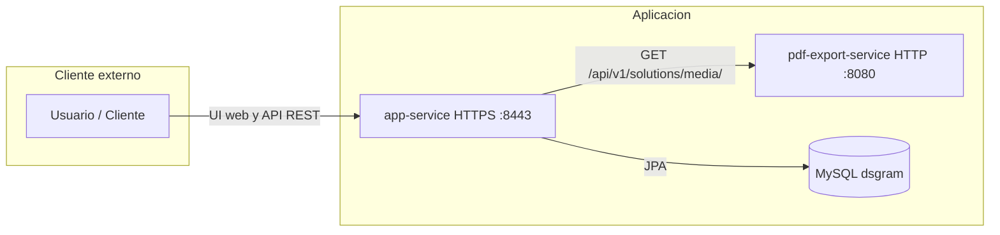

### **Vídeo de Demostración**
📹 **[Enlace al vídeo en YouTube](https://www.youtube.com/watch?v=ECXArVw0AcQ)**
> Vídeo mostrando las principales funcionalidades de la aplicación web.

---

### **Documentación de la API REST**

La aplicación ahora expone **dos APIs REST independientes**, una por cada servicio:

#### **`app-service` — API REST principal**
Gestiona usuarios, listas, ejercicios, soluciones y comentarios.

📄 **[Especificación OpenAPI (YAML)](app-service/backend/api-docs/api-docs.yaml)**
📖 **[Documentación HTML](https://raw.githack.com/CodeURJC-SSDD-2025-26/practica-ssdd-2025-26-grupo-15/main/app-service/backend/api-docs/api-docs.html)**

> Generada automáticamente con SpringDoc a partir de las anotaciones del código Java.

#### **`pdf-export-service` — API REST de exportación a PDF**
Recibe los datos de una solución y devuelve un PDF generado.

📄 **[Especificación OpenAPI (YAML)](pdf-export-service/backend/api-docs/api-docs.yaml)**
📖 **[Documentación HTML](https://raw.githack.com/CodeURJC-SSDD-2025-26/practica-ssdd-2025-26-grupo-15/main/pdf-export-service/backend/api-docs/api-docs.html)**

> El `app-service` llama a este servicio internamente via `POST /api/v1/pdf` cuando un usuario solicita exportar una solución.

---
### **Diagrama de Clases y Templates Actualizado**

Diagrama actualizado incluyendo los @RestController y su relación con los @Service compartidos:


---
### **Instrucciones de Ejecución (Desarrollo Local)**

#### **Requisitos Previos**
- **Java** 21 o superior
- **Maven** 3.8 o superior (`mvn`)
- **Docker** (para la base de datos MySQL)

#### **Pasos**

1. **Clonar el repositorio**
   ```bash
   git clone https://github.com/CodeURJC-SSDD-2025-26/practica-ssdd-2025-26-grupo-15.git
   cd practica-ssdd-2025-26-grupo-15
   ```

2. **Arrancar la base de datos MySQL**
   ```bash
   bash app-service/start_db.sh
   ```
   Levanta un contenedor MySQL 9.2 con la BD `dsgram` en el puerto `3306`.

3. **Crear los archivos `.env`**

   **`app-service/backend/.env`**:
   ```properties
   DB_USERNAME=<usuario>
   DB_PASSWORD=<contraseña>
   DB_NAME=<nombre-esquema>
   DB_CONFIG=<modo-inicializacion>
   KEYSTORE_PASSWORD=<contraseña-keystore>
   KEYSTORE_SECRET=<secreto-keystore>
   GOOGLE_CLIENT_ID=<client-id-google>
   GOOGLE_CLIENT_SECRET=<client-secret-google>
   GITHUB_CLIENT_ID=<client-id-github>
   GITHUB_CLIENT_SECRET=<client-secret-github>
   ```

   **`pdf-export-service/backend/.env`** (opcional, solo si quieres sobreescribir el puerto 8080 por defecto).

4. **Arrancar el `pdf-export-service`** (Terminal 1):
   ```bash
   mvn -f pdf-export-service/backend/pom.xml spring-boot:run
   ```
   Se levanta en HTTP en el puerto `8080`.

5. **Arrancar el `app-service`** (Terminal 2):
   ```bash
   mvn -f app-service/backend/pom.xml spring-boot:run
   ```
   Se levanta en HTTPS en el puerto `8443`.

6. **Acceder a la aplicación**:
   ```
   https://localhost:8443
   ```
   > El certificado es autofirmado; acepta la excepción de seguridad del navegador.

#### **Credenciales de prueba**
- **Admin**: `user1@example.com` / `pass`
- **Registrado**: `user2@example.com` / `pass`

---

### **Instrucciones de Ejecución con Docker**

#### **Requisitos previos**
- Docker 20.10 o superior
- Docker Compose 2.0 o superior

#### **Variables de entorno**

Crea un archivo `.env` en el directorio donde vayas a ejecutar `docker compose`:

```properties
DB_USERNAME=<usuario-bd>
DB_PASSWORD=<contraseña-bd>
DB_NAME=<nombre-esquema-BD>
DB_CONFIG=<modo-inicializacion-BD>
KEYSTORE_PASSWORD=<contraseña-keystore>
KEYSTORE_SECRET=<secreto-keystore>
GOOGLE_CLIENT_ID=<client-id-google>
GOOGLE_CLIENT_SECRET=<client-secret-google>
GITHUB_CLIENT_ID=<client-id-github>
GITHUB_CLIENT_SECRET=<client-secret-github>
```

El `docker-compose.yml` levanta **tres servicios** coordinados:
| Servicio | Imagen | Puerto |
|---|---|---|
| `db` | `mysql:9.6` | `3306` |
| `pdf` | `pruizz/dsgram-pdf-service-app:latest` | `8080` |
| `web` | `pruizz/dsgram-app-service-app:latest` | `8443` |

#### **Ejecutar con docker-compose**
```bash
docker compose -f docker/docker-compose.yml --env-file .env up
```

---

### **Construcción de Imágenes Docker**

Los scripts se encuentran en la carpeta `docker/`. Ejecuta siempre desde esa carpeta:

```bash
cd docker
```

#### **Construir las imágenes**

```bash
# app-service
./create-image.sh app-service <tu-usuario-dockerhub> <version-tag>

# pdf-export-service
./create-image.sh pdf-export-service <tu-usuario-dockerhub> <version-tag>
```

Las imágenes generadas se nombran:
- `<usuario>/dsgram-app-service-app:<tag>`
- `<usuario>/dsgram-pdf-service-app:<tag>`

#### **Publicar las imágenes en Docker Hub**

```bash
docker login

./publish_image.sh app-service <tu-usuario-dockerhub> <version-tag>
./publish_image.sh pdf-export-service <tu-usuario-dockerhub> <version-tag>
```

#### **Actualizar el docker-compose con los nuevos tags**

```bash
./publish_docker-compose.sh <tu-usuario-dockerhub> <version-tag>
```

### **Despliegue en Máquina Virtual**

#### **Requisitos**
- Acceso SSH a la VM
- Clave privada para autenticación

#### **Pasos**

1. **Conectar a la VM**:
   ```bash
   ssh -i ssh-keys/appWeb15.key vmuser@10.100.139.208
   ```

2. **Crear el archivo `.env`** (con las variables indicadas arriba).

3. **Desplegar**:
   ```bash
   docker compose -f docker/docker-compose.yml --env-file .env up -d
   ```

### **URL de la Aplicación Desplegada**

🌐 **URL de acceso**: `https://appweb15.dawgis.etsii.urjc.es:8443`

#### **Credenciales de Usuarios de Ejemplo**
- **Admin**: `user1@example.com` / `pass`
- **Registrado**: `user2@example.com` / `pass`

### **Participación de Miembros en la Práctica 3**

#### **Alumno 1 - Hugo Capa Mora**

Responsable de migrar la lógica de negocio a arquitectura API REST, implementando los RestControllers para las operaciones CRUD (GET, POST, PUT, DELETE) y creando los DTOs necesarios para la transferencia de datos y manejo de creación de imágenes. Colaborador de la creación de colecciones en Postman para el testeo de los endpoints. Adicionalmente, he colaborado en la configuración de Docker y Docker Compose para el despliegue de la aplicación y su posterior publicación en Docker Hub.

| Nº    | Commits      | Files      |
|:------------: |:------------:| :------------:|
|1| [Implement REST controllers for comments and solutions, enhance DTOs, and add solution creation logic without image](https://github.com/CodeURJC-DAW-2025-26/practica-daw-2025-26-grupo-15/commit/8cee39a4e536437e80c45dc6636a84f11593ea69)  | [SolutionRestController](app-service/backend/src/main/java/es/codeurjc/daw/library/controller/rest/SolutionRestController.java)   |
|2| [feat: enhance ExerciseList and Solution controllers with error handling and response improvements; add image to Solution upload functionality](https://github.com/CodeURJC-DAW-2025-26/practica-daw-2025-26-grupo-15/commit/65b04152a777480811c0a16f994af4f972af6d39)  | [SolutionRestController](app-service/backend/src/main/java/es/codeurjc/daw/library/controller/rest/SolutionRestController.java)   |
|3| [feat: enhance ExerciseList functionality with create and update operations; add ExerciseBasicInfoDTO and UserBasicDTO](https://github.com/CodeURJC-DAW-2025-26/practica-daw-2025-26-grupo-15/commit/88008ed4aeee0e5796463e778d033cd5bf60c683)  | [ExerciseListRestController](app-service/backend/src/main/java/es/codeurjc/daw/library/controller/rest/ExerciseListRestController.java)   |
|4| [feat: createSolution moved to ExerciseRestController, add ExerciseListPostDTO and SolutionPostDTO; update RestControllers to use new DTOs](https://github.com/CodeURJC-DAW-2025-26/practica-daw-2025-26-grupo-15/commit/85e916218dd945c68e63692235e065753a17483f)  | [ExerciseListRestController](app-service/backend/src/main/java/es/codeurjc/daw/library/controller/rest/ExerciseListRestController.java)   |
|5| [feat: implement ExerciseList REST controller with CRUD operations and DTO mapping](https://github.com/CodeURJC-DAW-2025-26/practica-daw-2025-26-grupo-15/commit/a41ac87a7890630b44057e65943996c866f7c0a1)  | [ExerciseListDTO](app-service/backend/src/main/java/es/codeurjc/daw/library/dto/ExerciseListDTO.java)   |

---

#### **Alumno 2 - Isidoro Pérez Rivera**

Responsable de la creación de los endpoints de la entidad Exercise. Implementación de las operaciones CRUD de la entidad Exercise y el diseño de la clase ExerciseRestController y sus respectivos DTOs. Diseño del esquema de clases mostrando la relación entre las clases REST y los Services. Creación de los scripts para publicación de imágenes y artefactos de docker y docker-compose y construcción de la imagen.

| Nº    | Commits      | Files      |
|:------------: |:------------:| :------------:|
|1| [Implement Exercise REST controller and service methods; add ExerciseDTO and UserIdDTO](https://github.com/CodeURJC-DAW-2025-26/practica-daw-2025-26-grupo-15/commit/2c44ea038ebc9dfdecf5799654e793b926194f8b)  | [ExerciseRestController](app-service/backend/src/main/java/es/codeurjc/daw/library/controller/rest/ExerciseRestController.java)   |
|2| [Add delete exercise functionality and update ExerciseDTO structure; introduce ExercisePostDTO and add post exercise functionality. Refactor ExerciseRestController for consistency](https://github.com/CodeURJC-DAW-2025-26/practica-daw-2025-26-grupo-15/commit/44ba3cef8a683f80291688c7bc4156281143c4e7)[Part 2](https://github.com/CodeURJC-DAW-2025-26/practica-daw-2025-26-grupo-15/commit/95478ec1f5b1ad9ccb7f1b08c5a62b3a2fb2907d) | [ExerciseRestController](app-service/backend/src/main/java/es/codeurjc/daw/library/controller/rest/ExerciseRestController.java)   |
|3| [Add updateExercise method and ExercisePutDTO for exercise updates](https://github.com/CodeURJC-DAW-2025-26/practica-daw-2025-26-grupo-15/commit/139051a35b1510500215cc97cd287367a2e19207)  | [ExerciseRestController](app-service/backend/src/main/java/es/codeurjc/daw/library/controller/rest/ExerciseRestController.java)   |
|4| [Enhance deleteExercise and updateExercise methods with error handling and response entity](https://github.com/CodeURJC-DAW-2025-26/practica-daw-2025-26-grupo-15/commit/d58eef948f1326885f41c85a4cbe8f6415295b37)  | [ExerciseRestController](app-service/backend/src/main/java/es/codeurjc/daw/library/controller/rest/ExerciseRestController.java)   |
|5| [Create rest class diagram and implement all docker and docker-compose scripts for building and publishing images and artifacts](https://github.com/CodeURJC-DAW-2025-26/practica-daw-2025-26-grupo-15/commit/a31d5ad56cd70e638bdb9bf53f99d9cc309d2399)  | [publish_docker-compose.sh](docker/publish_docker-compose.sh)   |

---

#### **Alumno 3 - Jaime Torroba Martínez**

Encargado del listado de todas las entidades listables de forma paginada y dinámica en base a parámetros para lo cual se llevó a cabo la refactorización de búsqueda de elementos listados en un Service, de manera que quede desplazada en la lógica de negocio y sea reutilizable. Encargado a su vez de los endpoints relacionados con la entidad Comentario y de la entidad Post, y con los relacionados con la carga, descarga y borrado del pdf de un ejercicio.

| Nº    | Commits      | Files      |
|:------------: |:------------:| :------------:|
|1| [Add pdf upload, download and deletition for Exercise entity](https://github.com/CodeURJC-DAW-2025-26/practica-daw-2025-26-grupo-15/commit/bf8a00880eb62dceca5ddcf6a5eb91336cd0a106)  | [ExerciseRestController](app-service/backend/src/main/java/es/codeurjc/daw/library/controller/rest/ExerciseRestController.java)   |
|2| [Add POST & DELETE methods for Post entity, and all methods involved. Fix multiple Security issues regarding authorization in deletition & update, and incorrect exception catches and server response.](https://github.com/CodeURJC-DAW-2025-26/practica-daw-2025-26-grupo-15/commit/c778eb4a26cad80b9280d258c44ed33af9360d15)  | [PostRestController](app-service/backend/src/main/java/es/codeurjc/daw/library/controller/rest/PostRestController.java)   |
|3| [Add Comment entity POST, GET & DELETE endpoints. Create CommentDTO's & CommentMapper along with implementation of CommentRestController. Fix wrong content load in previous web controllers for pageable petitions.](https://github.com/CodeURJC-DAW-2025-26/practica-daw-2025-26-grupo-15/commit/c2570bf7440f10493355ce697efe545a4f28e9fd)  | [CommentRestController](app-service/backend/src/main/java/es/codeurjc/daw/library/controller/rest/CommentRestController.java)   |
|4| [feat: complete paged GET petitions for users, posts, exercises and exerciselists depending on parameters.](https://github.com/CodeURJC-DAW-2025-26/practica-daw-2025-26-grupo-15/commit/1983d1d3201ce023bf2f9ddb226bed946e81f082)  | [SearchService](app-service/backend/src/main/java/es/codeurjc/daw/library/service/SearchService.java)   |
|5| [Refactor searching mecanism to SearchService. Add Page gets for every entity with variable results depending on parameters.](https://github.com/CodeURJC-DAW-2025-26/practica-daw-2025-26-grupo-15/commit/00611da9e53792ba9f8da390e09c17080806c0cb)  | [PostRestController](app-service/backend/src/main/java/es/codeurjc/daw/library/controller/rest/PostRestController.java)   |

En el último commit el archivo más relevante es realmente AdminService, sin embargo este fue eliminado y más tarde refactorizado en SearchService.

---

#### **Alumno 4 - Pablo Ruiz Uroz**

Responsable de la integración del sistema de autenticación mediante JWT. Desarrollo completo de los endpoints de la entidad usuario, junto con la documentación de la API REST. Preparación del sistema para un despliegue dual, permitiendo tanto la carga inicial de datos como la ejecución sin modificaciones en la base de datos. Implementación de un endpoint propio para la exportación a PDF y creación de la colección de Postman para el testing de la API. Desarrollo del Dockerfile y la configuración de Docker Compose. Separación del servicio de exportación a PDF en un microservicio independiente (`pdf-export-service`).

| Nº    | Commits      | Files      |
|:------------: |:------------:| :------------:|
|1| [Add JWT authentication](https://github.com/CodeURJC-DAW-2025-26/practica-daw-2025-26-grupo-15/commit/0cf19e3d77120507c6a2763654095ef37ee67c0d)  | [SecurityConfig](app-service/backend/src/main/java/es/codeurjc/daw/library/security/SecurityConfig.java)   |
|2| [Implement User REST endpoints for following logic with security, DTOs, mappers, and error handling](https://github.com/CodeURJC-DAW-2025-26/practica-daw-2025-26-grupo-15/commit/4240de136d9f3df0ef3c26cdaa6bc8ad185df49b)  | [UserRestController](app-service/backend/src/main/java/es/codeurjc/daw/library/controller/rest/UserRestController.java)   |
|3| [User CRUD operations and DTO manage](https://github.com/CodeURJC-DAW-2025-26/practica-daw-2025-26-grupo-15/commit/9ace2fed3b264810e6a03030a43fce0a5830fbf6)  | [UserRestController](app-service/backend/src/main/java/es/codeurjc/daw/library/controller/rest/UserRestController.java)   |
|4| [Add Image upload and Image REST controllers](https://github.com/CodeURJC-DAW-2025-26/practica-daw-2025-26-grupo-15/commit/288b2d13cbeb621469f13bac1307c954396c6e6c)  | [ImageRestController](app-service/backend/src/main/java/es/codeurjc/daw/library/controller/rest/ImageRestController.java)   |
|5| [Dual-start web deployment functionality and Postman collection with all endpoints, additional REST functionalities](https://github.com/CodeURJC-DAW-2025-26/practica-daw-2025-26-grupo-15/commit/4f1c7b39422ce904941afdc79bbe131879b5e875#diff-b357bac448d6dbc289cd88013dbf9cc867b6f020f90752c84719856323bb6c0a)  | [DSGram.postman_collection](app-service/DSGram.postman_collection.json)   |

---

